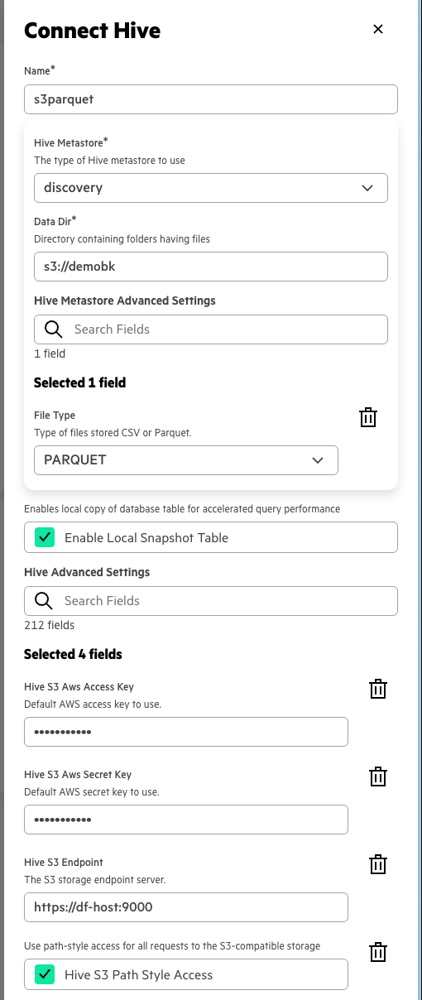

# End to End CDC using Data Fabric

## Components

- MySQL / MariaDB

- NiFi

- Hive & Zeppelin

- Presto & Superset


## Setup DB (MySQL/MariaDB)

- Install mysql server.

  `apt install mysql`


- Modify /etc/mysql/conf.d/mysqld.cnf to enable binlog:

  ```ini
  [mysqld]
  server_id = 1
  log_bin = delta
  binlog_format=row
  binlog_do_db = demodb
  ```

- Create database and user:

  `mysql -u root -p` and provide the root password.


  ```sql
  CREATE DATABASE demodb;

  USE demodb;

  CREATE TABLE `users` (
    `id` int NOT NULL AUTO_INCREMENT,
    `title` text,
    `first` text,
    `last` text,
    `street` text,
    `city` text,
    `state` text,
    `postcode` text,
    `country` text,
    `gender` text,
    `email` text,
    `uuid` text,
    `username` text,
    `password` text,
    `phone` text,
    `cell` text,
    `dob` datetime NULL DEFAULT NULL,
    `registered` datetime NULL DEFAULT NULL,
    `large` text,
    `medium` text,
    `thumbnail` text,
    `nat` text,
    PRIMARY KEY (`id`)
  ) ENGINE=InnoDB AUTO_INCREMENT=1 DEFAULT CHARSET=utf8mb4;

  ```


### Insert data into MySQL

API call to get a new list of users: https://randomuser.me/api/?results=10&format=csv

or use `python3 users.py --count <number_of_users>`


## Setup NiFi


- Install NiFi

  `apt install -y mapr-nifi`
  `/opt/mapr/server/configure.sh -R`

- Download and import [template](./CDC_from_MySQL_v2.xml).

- Edit processors for missing passwords, and change bucket, db names etc.


### Install/Enable MySQL CDC Extension for NiFi

- Place connector into: `/opt/mapr/nifi/nifi-1.28.0/extensions`

  `wget -P /opt/mapr/nifi/nifi-1.28.0/extensions https://repo1.maven.org/maven2/org/apache/nifi/nifi-cdc-mysql-nar/1.28.0/nifi-cdc-mysql-nar-1.28.0.nar`


### Install MySQL JDBC client

- Download from: `https://dev.mysql.com/downloads/connector/j/`


  `wget https://dev.mysql.com/get/Downloads/Connector-J/mysql-connector-j-9.3.0-1.el8.noarch.rpm`

  or

  `wget https://dev.mysql.com/get/Downloads/Connector-J/mysql-connector-j_9.3.0-1ubuntu22.04_all.deb`

  and it should be available in `/usr/share/java/mysql-connector-j-9.3.0.jar`, this location should be updated in the processor configuration in NiFi.


## Create Hive Table


`hive --service beeline`

`!connect jdbc:hive2://localhost:10000/default;ssl=true;auth=maprsasl`


```hiveql
CREATE TABLE users (
  id INT,
  title STRING,
  first STRING,
  last STRING,
  street STRING,
  city STRING,
  state STRING,
  postcode STRING,
  country STRING,
  gender STRING,
  email STRING,
  uuid STRING,
  username STRING,
  password STRING,
  phone STRING,
  cell STRING,
  dob STRING,
  registered STRING,
  large STRING,
  medium STRING,
  thumbnail STRING,
  nat STRING
);

```

### Zeppelin configuration

- Create new context

  ```ini
  hive.url = jdbc:hive2://localhost:10000/default;ssl=true;auth=maprsasl
  hive.user	= mapr	
  hive.password	= mapr	
  hive.driver =	org.apache.hive.jdbc.HiveDriver
  ```

- Use [Dashboard](./Dashboard.ipynb) or [Zeppelin Dashboard](./Dashboard_2M1KSJM36.zpln) file to query the Hive table.


#### Create S3 bucket

- Create alias

  `mc alias set dfhost https://dfhost:9000 myaccesskey mysecretkey`

- Create bucket

  `mc mb dfhost/demobk`


### Run NiFi flow


**Only inserts are replicated in this version.**

**Other SQL statements are logged with "failure" code.** They could be forwarded to another route, where they will be converted to parquet and put into S3 bucket.


### Setup Presto


- Connection to Hive Metastore (setup file MS as in docs)

  `https://docs.ezmeral.hpe.com/unified-analytics/15/EzPresto/connect-external-s3-data-source.html`

- Setup as shown below:

  

<!-- Create view in the catalog:

```sql
CREATE VIEW hivemeta.default.users AS
SELECT *
FROM dfcore.default.users;
``` -->

### Setup Superset

- Presto connection: `presto://ezpresto.demo.ez.win.lab:443/s3parquet`


Go to Datasets, add dataset `users` and create charts.

<!-- ```sql
SELECT * FROM s3parquet.default.users
``` -->
